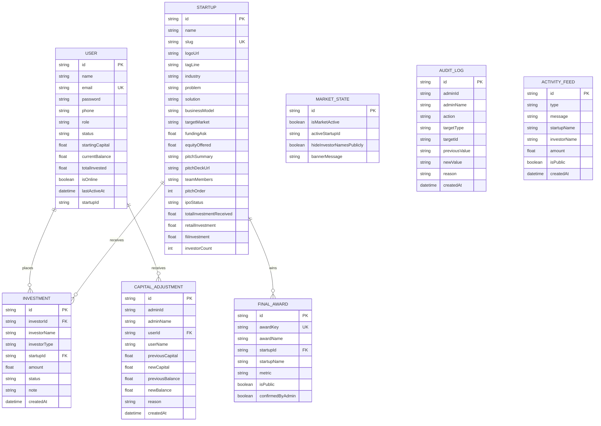
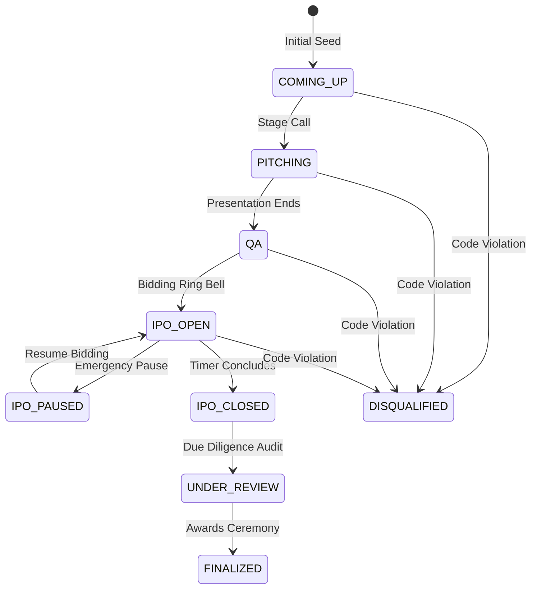

# IDEA TO IPO — Comprehensive Technical & System Specification Document
**Project Name**: IDEA TO IPO (Virtual Venture Capital & Live Startup IPO Simulator)  
**Edition**: Vision Club Live Auditorium Edition  
**Version**: `v2.0-LIVE` (Build: `1.0.0`)  
**Application Architecture**: Next.js 14 App Router, TypeScript, Prisma ORM, SQLite  
**Author / Organization**: Vision Club Technical & Operations Division  

---

## Table of Contents

1. [Executive Summary & System Purpose](#1-executive-summary--system-purpose)
2. [High-Level Architecture & Tech Stack](#2-high-level-architecture--tech-stack)
3. [Domain Data Models & Database Schema (Clause-by-Clause)](#3-domain-data-models--database-schema-clause-by-clause)
   - [3.1 User Entity](#31-user-entity)
   - [3.2 Startup Entity](#32-startup-entity)
   - [3.3 Investment Entity](#33-investment-entity)
   - [3.4 CapitalAdjustment Entity](#34-capitaladjustment-entity)
   - [3.5 MarketState Entity](#35-marketstate-entity)
   - [3.6 AuditLog Entity](#36-auditlog-entity)
   - [3.7 ActivityFeed Entity](#37-activityfeed-entity)
   - [3.8 FinalAward Entity](#38-finalaward-entity)
4. [Role-Based Access Control (RBAC) Specification](#4-role-based-access-control-rbac-specification)
   - [4.1 Role Definitions & Privileges](#41-role-definitions--privileges)
   - [4.2 Authentication & Session Lifecycle](#42-authentication--session-lifecycle)
5. [State Machine: Startup IPO Lifecycle & Transitions](#5-state-machine-startup-ipo-lifecycle--transitions)
   - [5.1 State Definitions & Allowed Actions](#51-state-definitions--allowed-actions)
   - [5.2 State Transition Matrix](#52-state-transition-matrix)
6. [Financial Engine, Transaction Logic & Integrity Rules](#6-financial-engine-transaction-logic--integrity-rules)
   - [6.1 Currency & Mathematical Standards (INR)](#61-currency--mathematical-standards-inr)
   - [6.2 Atomic Investment Execution Clause](#62-atomic-investment-execution-clause)
   - [6.3 Concurrency & Double-Spending Prevention](#63-concurrency--double-spending-prevention)
   - [6.4 Transaction Cancellation, Reversal & Restoration Clauses](#64-transaction-cancellation-reversal--restoration-clauses)
   - [6.5 Manual Capital Adjustment & Balance Delta Rules](#65-manual-capital-adjustment--balance-delta-rules)
   - [6.6 Manual Startup Total Override Rules](#66-manual-startup-total-override-rules)
   - [6.7 Master Emergency Circuit Breaker (Market Freeze)](#67-master-emergency-circuit-breaker-market-freeze)
7. [API Route Specifications (Complete REST Contract)](#7-api-route-specifications-complete-rest-contract)
   - [7.1 Investment Bidding API (`POST /api/investments`)](#71-investment-bidding-api-post-apiinvestments)
   - [7.2 Market Overview & Telemetry API (`GET /api/market/overview`)](#72-market-overview--telemetry-api-get-apimarketoverview)
   - [7.3 Market State API (`GET /api/market/state`)](#73-market-state-api-get-apimarketstate)
   - [7.4 Authentication APIs (`/api/auth/*`)](#74-authentication-apis-apiauth)
   - [7.5 Investor Portfolio API (`GET /api/portfolio`)](#75-investor-portfolio-api-get-apiportfolio)
   - [7.6 Startup Public APIs (`/api/startups/*`)](#76-startup-public-apis-apistartups)
   - [7.7 Admin Mission Control APIs (`/api/admin/*`)](#77-admin-mission-control-apis-apiadmin)
8. [Frontend Interface & Presentation Layer Architecture](#8-frontend-interface--presentation-layer-architecture)
   - [8.1 Global Design System & Cyber-Fintech Aesthetics](#81-global-design-system--cyber-fintech-aesthetics)
   - [8.2 Hero Landing & Fast 1-Tap Auth (`/`)](#82-hero-landing--fast-1-tap-auth-)
   - [8.3 Live Teams & Real-Time Bidding Dashboard (`/teams`)](#83-live-teams--real-time-bidding-dashboard-teams)
   - [8.4 Big Screen Auditorium Live Market & Leaderboard (`/market` & `/leaderboard`)](#84-big-screen-auditorium-live-market--leaderboard-market--leaderboard)
   - [8.5 Investor Portfolio & Asset Allocation Cockpit (`/portfolio`)](#85-investor-portfolio--asset-allocation-cockpit-portfolio)
   - [8.6 Startup Pitch Dossier & Real-Time Order Book (`/startup/[slug]`)](#86-startup-pitch-dossier--real-time-order-book-startupslug)
   - [8.7 FII Institutional Judge Terminal (`/fii`)](#87-fii-institutional-judge-terminal-fii)
   - [8.8 Retail Investor Terminal (`/investor`)](#88-retail-investor-terminal-investor)
   - [8.9 Event Mission Control Room (`/admin`)](#89-event-mission-control-room-admin)
9. [Automated Verification & Integrity Test Suite (16 Critical Scenarios)](#9-automated-verification--integrity-test-suite-16-critical-scenarios)
10. [Directory Structure & File Inventory](#10-directory-structure--file-inventory)
11. [Installation, Seeding, Running & Operations Manual](#11-installation-seeding-running--operations-manual)

---

## 1. Executive Summary & System Purpose

**IDEA TO IPO** is a high-performance, real-time virtual venture capital simulation and startup pitch exchange platform developed for live university and corporate entrepreneurship events hosted by **Vision Club**.

The platform simulates a live capital market where early-stage student and incubator startups pitch to both institutional venture capital judges (**FIIs**) and public audience participants (**Retail Investors**). As founders present on stage, the entire room participates via real-time bidding on their personal devices, while a continuous, high-definition market ticker and dynamic valuation leaderboard is broadcasted live to the auditorium stage projector.

### Core Objectives
1. **Real-Time Market Dynamic**: Replaces static judge scorecards with live, demand-driven venture valuations determined by market order books.
2. **Zero Financial Risk / Educational Safety**: All currency is virtual Indian Rupees (INR `₹`), seeded to participant accounts upon entry.
3. **Institutional Rigor & Auditing**: Every transaction is atomic, idempotent, non-overdrafting, and permanently indexed in an immutable audit ledger.
4. **Master Administrative Governance**: The Event Director maintains absolute administrative control over market states, individual startup IPO gates, capital disbursements, manual overrides, and transaction cancellations.

---

## 2. High-Level Architecture & Tech Stack

The system follows a modern monolithic Next.js architecture leveraging Server Components and Client Components, backed by a persistent SQLite embedded database managed via Prisma ORM.

```
┌────────────────────────────────────────────────────────────────────────┐
│                          PRESENTATION LAYER                            │
│  Next.js 14 App Router (React 18) • Tailwind CSS • Recharts • Canvas-Confetti │
│                                                                        │
│  ┌───────────────┐ ┌───────────────┐ ┌───────────────┐ ┌────────────┐  │
│  │ Public Screen │ │  Judge Term.  │ │ Retail Pitch  │ │ Admin Room │  │
│  │ (/market)     │ │  (/fii)       │ │ (/teams)      │ │ (/admin)   │  │
│  └───────┬───────┘ └───────┬───────┘ └───────┬───────┘ └──────┬─────┘  │
└──────────┼─────────────────┼─────────────────┼────────────────┼────────┘
           │                 │                 │                │
           ▼                 ▼                 ▼                ▼
┌────────────────────────────────────────────────────────────────────────┐
│                        API & APPLICATION LAYER                         │
│  Route Handlers (/api/*) • Atomic Transactions • Cookie/Header Auth    │
│                                                                        │
│  ┌───────────────────────┐ ┌───────────────────┐ ┌──────────────────┐  │
│  │ Investments Engine    │ │ Market Telemetry  │ │ Admin Governance │  │
│  │ - Deduct Balance      │ │ - Polling & Feed  │ │ - Circuit Breaker│  │
│  │ - Increment Startup   │ │ - Trend Curves    │ │ - Audit Logging  │  │
│  └───────────┬───────────┘ └─────────┬─────────┘ └────────┬─────────┘  │
└──────────────┼───────────────────────┼────────────────────┼────────────┘
               │                       │                    │
               ▼                       ▼                    ▼
┌────────────────────────────────────────────────────────────────────────┐
│                            DATA ACCESS LAYER                           │
│  Prisma ORM 5.21 (PrismaClient Singleton) • SQLite Database (dev.db)   │
│                                                                        │
│  [User] ──< [Investment] >── [Startup] ──< [FinalAward]                │
│  [User] ──< [CapitalAdjustment]                                        │
│  [MarketState] • [AuditLog] • [ActivityFeed]                           │
└────────────────────────────────────────────────────────────────────────┘
```

### Technology Specifications

| Component | Library / Framework | Version | Function / Purpose |
| :--- | :--- | :--- | :--- |
| **Framework** | Next.js (App Router) | `^14.2.15` | Full-stack server and client routing, streaming, and API endpoints |
| **Runtime** | Node.js | `>=20.x` | Server execution runtime |
| **Language** | TypeScript | `^5.6.3` | Type safety and strict domain modeling across backend and frontend |
| **Database ORM** | Prisma Client & CLI | `^5.21.1` | Type-safe query generation, migrations, and transactional execution |
| **Database Engine** | SQLite 3 | Embedded | High-throughput local transactional relational storage (`prisma/dev.db`) |
| **Styling** | Tailwind CSS | `^3.4.14` | Utility-first cyber-fintech styling, custom glassmorphism, and dark palettes |
| **Charts** | Recharts | `^2.13.0` | Real-time valuation area charts, timeline graphs, and allocation donuts |
| **Icons** | Lucide React | `^0.453.0` | Comprehensive interface iconography |
| **Celebrations** | Canvas-Confetti | `^1.9.3` | Micro-interaction visual feedback upon confirmed investments |
| **Test Runner** | tsx | `^4.19.1` | Native TypeScript script execution for automated scenario verification |

---

## 3. Domain Data Models & Database Schema (Clause-by-Clause)

The relational schema is configured in [`prisma/schema.prisma`](file:///c:/Projects/IPO/prisma/schema.prisma). Each model serves a distinct operational clause.



---

### 3.1 User Entity
Represents every human participant connecting to the platform (Administrators, Institutional Judges, Retail Audience Members, and Pitching Founders).

* **`id`** (`String`, `@id`, `@default(cuid())`): Unique system identifier.
* **`name`** (`String`): Full name or institutional firm title (e.g., `"Nexus Horizon Capital"`, `"Rahul Verma"`).
* **`email`** (`String`, `@unique`): Primary authentication identifier.
* **`password`** (`String`, `@default("ipo2026")`): Plain-text authentication secret for rapid event check-in.
* **`phone`** (`String?`): Optional contact number for participant verification.
* **`role`** (`String`): Must be one of four values:
  - `ADMIN`: Full unrestricted access to mission control, circuit breakers, and financial overrides.
  - `STARTUP`: Pitching founder account tied to a specific startup record via `startupId`.
  - `RETAIL`: General audience investor with standard retail capital allocation.
  - `FII`: Institutional venture partner / event judge holding substantial cheque capacity.
* **`status`** (`String`, `@default("ACTIVE")`): Account gating status. Can be `ACTIVE` or `BLOCKED`. If `BLOCKED`, authentication and bidding are immediately denied.
* **`startingCapital`** (`Float`, `@default(0)`): Total nominal capital allocated to the user for the event (e.g., ₹5,00,000 for Retail, ₹1,00,00,000 for FII).
* **`currentBalance`** (`Float`, `@default(0)`): Available liquid capital ready to be deployed into active IPOs.
* **`totalInvested`** (`Float`, `@default(0)`): Cumulative capital committed into `VALID` startup investments.
* **`isOnline`** (`Boolean`, `@default(false)`): Real-time presence flag indicating if user is actively polling the platform.
* **`lastActiveAt`** (`DateTime`, `@default(now())`): Timestamp of the most recent API request or heartbeat.
* **`startupId`** (`String?`): Foreign key reference linking `STARTUP` users to their company.
* **`createdAt` / `updatedAt`** (`DateTime`): Audit timestamps.

---

### 3.2 Startup Entity
Represents the companies participating in the pitch competition.

* **`id`** (`String`, `@id`, `@default(cuid())`): Unique identifier (e.g., `"startup-finflow"`).
* **`name`** (`String`): Registered venture name (e.g., `"FinFlow"`).
* **`slug`** (`String`, `@unique`): URL-safe lowercase slug (e.g., `"finflow"`).
* **`logoUrl`** (`String?`): Web link to company branding image.
* **`tagLine`** (`String`): One-sentence elevator pitch.
* **`industry`** (`String`): Market sector (e.g., `"Fintech & Web3"`, `"CleanTech & EV Mobility"`).
* **`problem`** (`String`): Deep dive into the market pain point addressed.
* **`solution`** (`String`): Technical or operational solution created.
* **`businessModel`** (`String`): Revenue generation mechanism and unit economics.
* **`targetMarket`** (`String`): TAM, SAM, and SOM figures.
* **`fundingAsk`** (`Float`): Virtual capital targeted in the pitch (e.g., ₹1,00,00,000).
* **`equityOffered`** (`Float?`): Nominal percentage of equity offered (e.g., 7.5%).
* **`pitchSummary`** (`String`): Historical traction, revenue figures, and pilot milestones.
* **`pitchDeckUrl`** (`String?`): Link to downloadable PDF presentation deck.
* **`teamMembers`** (`String`): Serialized JSON array containing founder profiles (`name`, `role`, `avatar`, `bio`).
* **`pitchOrder`** (`Int`, `@default(1)`): Sequence index for the on-stage presentation schedule.
* **`ipoStatus`** (`String`, `@default("COMING_UP")`): Current market lifecycle gate (detailed in Section 5).
* **`totalInvestmentReceived`** (`Float`, `@default(0)`): Cumulative sum of all valid investments received.
* **`retailInvestment`** (`Float`, `@default(0)`): Breakdown of funds from `RETAIL` participants.
* **`fiiInvestment`** (`Float`, `@default(0)`): Breakdown of funds from `FII` institutional judges.
* **`investorCount`** (`Int`, `@default(0)`): Number of distinct bids committed to this startup.

---

### 3.3 Investment Entity
Represents an individual bid executed by an investor during an open IPO window.

* **`id`** (`String`, `@id`): Custom identifier formatted as `INV-XXXXXX` (e.g., `INV-821943`).
* **`investorId`** (`String`): Foreign key referencing `User.id` (cascades on delete).
* **`investorName`** (`String`): Snapshot of investor's name at the time of bidding.
* **`investorType`** (`String`): `"RETAIL"` or `"FII"`.
* **`startupId`** (`String`): Foreign key referencing `Startup.id` (cascades on delete).
* **`amount`** (`Float`): Capital sum committed in INR.
* **`status`** (`String`, `@default("VALID")`):
  - `VALID`: Active, fully funded investment counted in all totals.
  - `CANCELLED`: Annulled by administrator; investor capital refunded and startup total decremented.
  - `REVERSED`: Explicit reversal processed under administrative sanction.
  - `UNDER_REVIEW`: Temporarily quarantined during due diligence audit.
* **`note`** (`String?`): Administrative justification or audit rationale if modified.
* **`createdAt` / `updatedAt`** (`DateTime`): Transaction timestamps.

---

### 3.4 CapitalAdjustment Entity
Audit ledger capturing every direct modification of a participant's capital allocation by an event administrator.

* **`id`** (`String`, `@id`, `@default(cuid())`): Unique record identifier.
* **`adminId`** (`String`): ID of administrator authorizing the adjustment.
* **`adminName`** (`String`): Snapshot name of administrator.
* **`userId`** (`String`): Target user whose funds were adjusted (cascades on delete).
* **`userName`** (`String`): Name snapshot of target user.
* **`previousCapital`** (`Float`): Original `startingCapital` prior to adjustment.
* **`newCapital`** (`Float`): Updated `startingCapital`.
* **`previousBalance`** (`Float`): User's `currentBalance` before delta application.
* **`newBalance`** (`Float`): Updated liquid balance following delta recalculation.
* **`reason`** (`String`): Mandatory explanation (e.g., `"Sponsor quota increase for event judge"`).
* **`createdAt`** (`DateTime`, `@default(now())`): Timestamp.

---

### 3.5 MarketState Entity
Singleton global switch controlling macro market conditions (`id = "global"`).

* **`id`** (`String`, `@id`, `@default("global")`): Singleton identifier.
* **`isMarketActive`** (`Boolean`, `@default(true)`): Emergency Master Circuit Breaker switch. When set to `false`, **all bidding across all startups is instantaneously rejected**.
* **`activeStartupId`** (`String?`): ID of startup currently on stage or whose order book is highlighted.
* **`hideInvestorNamesPublicly`** (`Boolean`, `@default(false)`): Anonymity mask for the public auditorium screen (masks names as `"Verified Investor"`).
* **`bannerMessage`** (`String?`): Broadcast ticker message pushed to the top of all client screens.

---

### 3.6 AuditLog Entity
Immutable system-wide compliance log capturing administrative operations.

* **`id`** (`String`, `@id`, `@default(cuid())`): Unique record identifier.
* **`adminId`** (`String`): Identifier of user triggering action.
* **`adminName`** (`String`): Administrator name snapshot.
* **`action`** (`String`): Event descriptor (`"FREEZE_MARKET"`, `"RESUME_MARKET"`, `"SET_IPO_STATUS_IPO_OPEN"`, `"ADJUST_CAPITAL"`, `"CANCEL_TRANSACTION_CANCELLED"`, `"MANUAL_TOTAL_OVERRIDE"`, `"CONFIRM_FINAL_AWARD"`).
* **`targetType`** (`String`): Category of impacted entity (`"SYSTEM"`, `"MARKET"`, `"STARTUP"`, `"USER"`, `"INVESTMENT"`, `"AWARD"`).
* **`targetId`** (`String`): Specific ID of impacted record.
* **`previousValue`** (`String?`): State snapshot prior to change.
* **`newValue`** (`String?`): State snapshot following change.
* **`reason`** (`String?`): Mandatory justification entered by administrator.
* **`createdAt`** (`DateTime`, `@default(now())`): Timestamp.

---

### 3.7 ActivityFeed Entity
Real-time public events broadcasted across client screens.

* **`id`** (`String`, `@id`, `@default(cuid())`): Unique record identifier.
* **`type`** (`String`): Event classifier (`"INVESTMENT"`, `"IPO_STATUS"`, `"USER_JOINED"`, `"ADMIN_ACTION"`).
* **`message`** (`String`): Formatted notification string.
* **`startupName`** (`String?`): Associated startup name if applicable.
* **`investorName`** (`String?`): Associated investor name if applicable.
* **`amount`** (`Float?`): Associated transaction value in INR.
* **`isPublic`** (`Boolean`, `@default(true)`): Toggle controlling visibility on public screens.
* **`createdAt`** (`DateTime`, `@default(now())`): Timestamp.

---

### 3.8 FinalAward Entity
Tracks the official awards presented during the post-market closing ceremony.

* **`id`** (`String`, `@id`, `@default(cuid())`): Unique award identifier.
* **`awardKey`** (`String`, `@unique`): Internal enum key:
  - `CHAMPION`: Highest overall cumulative valuation.
  - `MOST_FUNDED`: Top gross capital raised.
  - `HIGHEST_FII`: Maximum institutional backing.
  - `RETAIL_CHOICE`: Most distributed retail cap table.
  - `MOST_OVERSUBSCRIBED`: Highest ratio of funds raised versus funding ask.
* **`awardName`** (`String`): Formal trophy title (e.g., `"IPO Grand Champion"`).
* **`startupId`** (`String?`): Winner startup foreign key reference.
* **`startupName`** (`String?`): Winner startup name snapshot.
* **`metric`** (`String?`): Quantitative justification (e.g., `"₹1,45,00,000 Raised"`, `"1.45x Subscribed"`).
* **`isPublic`** (`Boolean`, `@default(true)`): Presentation visibility toggle.
* **`confirmedByAdmin`** (`Boolean`, `@default(false)`): Confirmation lock. Once confirmed, results are certified.

---

## 4. Role-Based Access Control (RBAC) Specification

The system implements strict Role-Based Access Control enforcing distinct views, capabilities, and API gates.

| Feature / Action | `ADMIN` (Director) | `FII` (Judge) | `RETAIL` (Audience) | `STARTUP` (Founder) | Anonymous |
| :--- | :---: | :---: | :---: | :---: | :---: |
| View Public Market & Leaderboard | Yes | Yes | Yes | Yes | Yes |
| View Startup Pitch Dossiers | Yes | Yes | Yes | Yes | Yes |
| Bid on Live IPO (`IPO_OPEN`) | No (Observer) | **Yes** (Cheques up to balance) | **Yes** (Bids up to balance) | No | No |
| Access Institutional Terminal (`/fii`) | **Yes** | **Yes** | No | No | No |
| Access Retail Terminal (`/investor`) | **Yes** | No | **Yes** | No | No |
| Access Personal Portfolio (`/portfolio`) | No | **Yes** | **Yes** | No | No |
| Toggle Global Emergency Freeze | **Yes** | No | No | No | No |
| Transition Startup IPO Status | **Yes** | No | No | No | No |
| Block / Unblock Users | **Yes** | No | No | No | No |
| Adjust User Capital Allocations | **Yes** | No | No | No | No |
| Cancel / Reverse Investments | **Yes** | No | No | No | No |
| Apply Manual Valuation Overrides | **Yes** | No | No | No | No |
| Finalize & Confirm Official Awards | **Yes** | No | No | No | No |
| Reset Demo Seed Database | **Yes** | No | No | No | No |

---

### 4.2 Authentication & Session Lifecycle

Authentication operates via HTTP cookies supplemented by custom request headers for decoupled API clients:

1. **Session Cookie**: Named `idea_ipo_user_id`. Stored with `path: "/"`, `sameSite: "lax"`, and a lifespan of 7 days (`maxAge: 604800`).
2. **Identification Fallback (`x-user-id`)**: API endpoints inspect `request.headers.get("x-user-id")` if no cookie is present.
3. **Heartbeat Updating**: Every authenticated request triggers an update in `User.lastActiveAt` and sets `User.isOnline = true`.
4. **Suspension Interceptor**: If a user's record has `status === "BLOCKED"`, `getCurrentUser()` immediately returns `null`, revoking all session privileges.

---

## 5. State Machine: Startup IPO Lifecycle & Transitions

Each startup progresses through a linear, strictly governed status lifecycle managed in real-time from the Admin Mission Control Room.



### 5.1 State Definitions & Allowed Actions

| State Enum | UI Display Badge | Color Class | Can Accept Bids? | Operational Meaning |
| :--- | :--- | :--- | :---: | :--- |
| **`COMING_UP`** | `COMING UP` | `bg-zinc-800 text-zinc-400 border-zinc-700` | **No** | Scheduled in presentation queue. Not yet on stage. |
| **`PITCHING`** | `NOW PITCHING` | `bg-cyan-500/20 text-cyan-400 border-cyan-500/40` | **No** | Founder is speaking on the auditorium stage. |
| **`QA`** | `Q&A SESSION` | `bg-purple-500/20 text-purple-400 border-purple-500/40` | **No** | Judges are cross-examining founder unit economics. |
| **`IPO_OPEN`** | `IPO LIVE` | `bg-emerald-500/20 text-emerald-400 border-emerald-500/40` | **YES** | **Bidding window is officially live.** Investors can deploy funds. |
| **`IPO_PAUSED`** | `IPO PAUSED` | `bg-amber-500/20 text-amber-400 border-amber-500/40` | **No** | Admin temporarily paused bidding (e.g. mic swap or clarification). |
| **`IPO_CLOSED`** | `MARKET CLOSED` | `bg-slate-500/20 text-slate-400 border-slate-600/40` | **No** | Bidding clock expired. Order books closed. |
| **`UNDER_REVIEW`** | `UNDER REVIEW` | `bg-blue-500/20 text-blue-400 border-blue-500/40` | **No** | Due diligence and transaction validation in progress. |
| **`FINALIZED`** | `FINALIZED` | `bg-indigo-500/20 text-indigo-400 border-indigo-500/40` | **No** | Valuation and allocations confirmed as permanent. |
| **`DISQUALIFIED`**| `DISQUALIFIED` | `bg-rose-500/20 text-rose-400 border-rose-500/40` | **No** | Team disqualified for event policy violations. |

---

## 6. Financial Engine, Transaction Logic & Integrity Rules

### 6.1 Currency & Mathematical Standards (INR)
All calculations are carried out in standard Indian Rupees (INR `₹`) using JavaScript 64-bit floating point math rounded to integer currency units.

```typescript
// Compact notation converter (formatINR)
if (Math.abs(amount) >= 10000000) return `₹${(amount / 10000000).toFixed(2)} Cr`;
if (Math.abs(amount) >= 100000)   return `₹${(amount / 100000).toFixed(2)} L`;
if (Math.abs(amount) >= 1000)     return `₹${(amount / 1000).toFixed(1)}k`;
```

#### Subscription Ratio & Status Classification
$$\text{Subscription Ratio} = \frac{\text{Total Investment Received}}{\text{Funding Ask}}$$

* **`UNDERSUBSCRIBED`**: Ratio $< 0.95X$ (Badge: Amber)
* **`FULLY_SUBSCRIBED`**: $0.95X \le \text{Ratio} \le 1.05X$ (Badge: Cyan)
* **`OVERSUBSCRIBED`**: Ratio $> 1.05X$ (Badge: Emerald)

---

### 6.2 Atomic Investment Execution Clause

Every investment execution in [`src/app/api/investments/route.ts`](file:///c:/Projects/IPO/src/app/api/investments/route.ts) is wrapped in a transactional closure (`prisma.$transaction`).

```typescript
const result = await prisma.$transaction(async (tx) => {
  // 1. Lock and retrieve current user balance
  const freshUser = await tx.user.findUnique({ where: { id: user.id } });
  if (freshUser.currentBalance < amount) {
    throw new Error("Insufficient available balance!");
  }

  // 2. Decrement balance & increment total invested
  const updatedUser = await tx.user.update({
    where: { id: freshUser.id },
    data: {
      currentBalance: { decrement: amount },
      totalInvested: { increment: amount },
      lastActiveAt: new Date(),
    },
  });

  // 3. Create unique Investment record
  const investment = await tx.investment.create({
    data: {
      id: `INV-${Math.floor(100000 + Math.random() * 900000)}`,
      investorId: freshUser.id,
      investorName: freshUser.name,
      investorType: freshUser.role as "RETAIL" | "FII",
      startupId: startup.id,
      amount: amount,
      status: "VALID",
    },
  });

  // 4. Increment startup investment totals & breakdown
  const updatedStartup = await tx.startup.update({
    where: { id: startup.id },
    data: {
      totalInvestmentReceived: { increment: amount },
      ...(freshUser.role === "RETAIL" ? { retailInvestment: { increment: amount } } : {}),
      ...(freshUser.role === "FII" ? { fiiInvestment: { increment: amount } } : {}),
      investorCount: { increment: 1 },
    },
  });

  // 5. Broadcast to public activity feed
  await tx.activityFeed.create({
    data: {
      type: "INVESTMENT",
      message: `${freshUser.name} (${freshUser.role}) invested ${formattedAmount} in ${startup.name}`,
      startupName: startup.name,
      investorName: freshUser.name,
      amount: amount,
      isPublic: true,
    },
  });

  return { investment, updatedUser, updatedStartup };
});
```

---

### 6.3 Concurrency & Double-Spending Prevention
* **Isolation Guarantee**: SQLite's write serialization in combination with Prisma transactions ensures that two concurrent requests attempting to spend a single user's balance are queued sequentially.
* **Validation Checkpoint**: The second transaction reads the decremented balance produced by the first transaction; if the remaining funds are insufficient, the transaction throws an immediate error and rolls back completely without partial state changes.

---

### 6.4 Transaction Cancellation, Reversal & Restoration Clauses

Handled in [`src/app/api/admin/transactions/[id]/cancel/route.ts`](file:///c:/Projects/IPO/src/app/api/admin/transactions/[id]/cancel/route.ts):

1. **Cancellation / Reversal**:
   - Updates `Investment.status` to `CANCELLED` or `REVERSED`.
   - Restores the investor's balance: `currentBalance = currentBalance + amount`, `totalInvested = totalInvested - amount`.
   - Deducts from the startup's balance: `totalInvestmentReceived = totalInvestmentReceived - amount` and decreases respective `retailInvestment` or `fiiInvestment`.
   - Writes an entry into `AuditLog` recording the refund.
   - Pushes an announcement to `ActivityFeed`.
2. **Restoration (`RESTORE`)**:
   - Validates that the investor still possesses sufficient available balance (`currentBalance >= amount`).
   - Re-deducts the balance, restores startup totals, and sets `status = "VALID"`.

---

### 6.5 Manual Capital Adjustment & Balance Delta Rules

Handled in [`src/app/api/admin/users/[id]/capital/route.ts`](file:///c:/Projects/IPO/src/app/api/admin/users/[id]/capital/route.ts):

When an administrator adjusts a participant's nominal capital:
$$\Delta_{\text{Capital}} = \text{newCapital} - \text{previousCapital}$$
$$\text{newBalance} = \max(0, \text{previousBalance} + \Delta_{\text{Capital}})$$

* If capital is increased from ₹5L to ₹10L ($\Delta = +₹5\text{L}$), the user's available balance increases by ₹5L.
* If capital is reduced, balance is reduced by the same delta, bounded by a minimum of ₹0.
* A mandatory reason string is required and logged into `CapitalAdjustment` and `AuditLog`.

---

### 6.6 Manual Startup Total Override Rules

Handled in [`src/app/api/admin/startups/override/route.ts`](file:///c:/Projects/IPO/src/app/api/admin/startups/override/route.ts):

* Administrators can directly set a startup's `totalInvestmentReceived` to correct discrepancies or apply offline stage penalties.
* **Validation**: `newTotal >= 0` and `reason.trim().length >= 5`. Requests failing these constraints return HTTP `400 Bad Request`.
* All overrides are indexed in `AuditLog` with previous value, new value, and rationale.

---

### 6.7 Master Emergency Circuit Breaker (Market Freeze)

Handled in [`src/app/api/admin/market/freeze/route.ts`](file:///c:/Projects/IPO/src/app/api/admin/market/freeze/route.ts):

* When triggered, sets `MarketState.isMarketActive = false`.
* Every invocation of `POST /api/investments` inspects `MarketState.isMarketActive`. If `false`, the request aborts with HTTP `403 Forbidden` (`"The entire market is currently PAUSED by event administrators."`).
* Visual indicators across all client navbars transition from green `"MARKET ACTIVE"` to flashing red `"MARKET PAUSED"`.

---

## 7. API Route Specifications (Complete REST Contract)

### 7.1 Investment Bidding API
* **Endpoint**: `POST /api/investments`
* **Access**: Authenticated `RETAIL` or `FII` users.
* **Request Body**:
  ```json
  {
    "startupId": "startup-finflow",
    "amount": 500000,
    "userId": "user-retail-1"
  }
  ```
* **Success Response (`200 OK`)**:
  ```json
  {
    "success": true,
    "transactionId": "INV-749213",
    "amount": 500000,
    "startupName": "FinFlow",
    "newAvailableBalance": 0,
    "totalInvested": 500000,
    "message": "Successfully invested in FinFlow!"
  }
  ```
* **Error Responses**:
  - `400 Bad Request`: Invalid amount, or startup IPO is not in `IPO_OPEN` state, or insufficient balance.
  - `401 Unauthorized`: No user session found.
  - `403 Forbidden`: User is blocked, role is unauthorized, or global market is frozen.
  - `404 Not Found`: Startup record does not exist.

---

### 7.2 Market Overview & Telemetry API
* **Endpoint**: `GET /api/market/overview`
* **Access**: Public.
* **Cache Control**: Dynamic (`force-dynamic`).
* **Success Response (`200 OK`)**:
  ```json
  {
    "isMarketActive": true,
    "activeStartupId": "startup-finflow",
    "activeStartup": { ... },
    "hideInvestorNamesPublicly": false,
    "totalMarketInvestment": 45000000,
    "totalRetailInvestment": 15000000,
    "totalFIIInvestment": 30000000,
    "activeInvestorsCount": 24,
    "totalStartupsCount": 4,
    "openIposCount": 1,
    "totalTransactionsCount": 58,
    "leaderboard": [ ... ],
    "recentActivities": [ ... ],
    "chartTrends": [ ... ]
  }
  ```

---

### 7.3 Market State API
* **Endpoint**: `GET /api/market/state`
* **Access**: Public lightweight polling endpoint for global circuit breaker status.
* **Success Response (`200 OK`)**:
  ```json
  {
    "id": "global",
    "isMarketActive": true,
    "activeStartupId": "startup-finflow",
    "hideInvestorNamesPublicly": false,
    "bannerMessage": null
  }
  ```

---

### 7.4 Authentication APIs
* **`POST /api/auth/login`**:
  - **Body**: `{ "userId": "user-id" }` (1-Tap Fast Login) OR `{ "email": "user@example.com", "password": "password" }`.
  - **Sets Cookie**: `idea_ipo_user_id`.
  - **Returns**: `{ "success": true, "user": SafeUser }`.
* **`POST /api/auth/logout`**:
  - Sets `User.isOnline = false` and deletes `idea_ipo_user_id` cookie.
* **`GET /api/auth/me`**:
  - Returns `{ "user": SafeUser | null }`.

---

### 7.5 Investor Portfolio API
* **Endpoint**: `GET /api/portfolio`
* **Access**: Authenticated Investors (`RETAIL` or `FII`).
* **Success Response (`200 OK`)**:
  ```json
  {
    "user": {
      "id": "user-retail-1",
      "name": "Rahul Verma",
      "role": "RETAIL",
      "startingCapital": 500000,
      "currentBalance": 200000,
      "totalInvested": 300000
    },
    "holdings": [
      {
        "startupId": "startup-finflow",
        "startupName": "FinFlow",
        "slug": "finflow",
        "totalInvested": 300000,
        "transactionCount": 2,
        "allocationPercent": 100
      }
    ],
    "totalHoldingsCount": 1,
    "recentTransactions": [ ... ]
  }
  ```

---

### 7.6 Startup Public APIs
* **`GET /api/startups`**: Returns array of all startups sorted by presentation order (`pitchOrder: "asc"`).
* **`GET /api/startups/[slug]`**: Returns startup details along with the latest 20 valid transactions committed to that startup.

---

### 7.7 Admin Mission Control APIs
* **`GET /api/admin/users`**: Returns complete user directory with role, status, liquid balances, and total investments.
* **`POST /api/admin/users/[id]/capital`**: Adjusts user capital (`{ "newCapital": 8000000, "reason": "Sponsor quota increase" }`).
* **`POST /api/admin/users/[id]/status`**: Sets user status to `ACTIVE` or `BLOCKED`.
* **`GET /api/admin/transactions`**: Returns all transaction records with startup and investor metadata.
* **`POST /api/admin/transactions/[id]/cancel`**: Cancels or restores transaction (`{ "action": "CANCEL" | "RESTORE", "reason": "..." }`).
* **`POST /api/admin/startups/[id]/status`**: Changes startup IPO lifecycle status (`{ "status": "IPO_OPEN", "reason": "..." }`).
* **`POST /api/admin/startups/override`**: Manually overrides valuation total (`{ "startupId": "...", "newTotal": 12000000, "reason": "..." }`).
* **`POST /api/admin/market/freeze`**: Toggles master circuit breaker (`{ "isMarketActive": false, "reason": "..." }`).
* **`GET /api/admin/audit-logs`**: Retrieves chronological audit ledger (last 100 actions).
* **`GET /api/admin/awards`**: Returns current award states, startups, and automated algorithmic recommendations.
* **`POST /api/admin/awards`**: Updates and confirms official award winners.
* **`POST /api/admin/reset-demo`**: Re-executes the database seed script to restore clean baseline demo state.

---

## 8. Frontend Interface & Presentation Layer Architecture

### 8.1 Global Design System & Cyber-Fintech Aesthetics
The interface incorporates modern cyber-fintech styling optimized for high contrast under auditorium stage lighting:
* **Background Palette**: Dark obsidian `#060911` with semi-translucent glass panels (`glass-panel`).
* **Accent Tones**: Neon Emerald (`#00e599`) for liquidity gains, Neon Cyan (`#00c8ff`) for tech metrics, Amber Gold (`#f59e0b`) for institutional/FII tiers, Rose (`#ef4444`) for circuit breaker stops.
* **Typography**: Monospaced font hierarchy for all currency values, transaction hashes, and status badges (`JetBrains Mono`, `font-mono`).

---

### 8.2 Hero Landing & Fast 1-Tap Auth (`/`)
* **Single-Screen Layout**: Designed strictly within viewport limits without vertical scrolling (`h-[calc(100vh-68px)]`).
* **Hero Background**: Displays `public/hero-bg.png` with gradient masking to ensure readability.
* **1-Tap Demo Switcher**: Instant login buttons for Retail, Judge, Founder, and Admin accounts allowing immediate simulation switching.

---

### 8.3 Live Teams & Real-Time Bidding Dashboard (`/teams`)
* **Live Mini Trendlines**: Every startup card features an embedded real-time Area Chart (`TeamRealtimeGraph`) rendering funding growth over time.
* **Instant Bidding Modal**: Modal with one-tap quick amount buttons (`₹25k`, `₹50k`, `₹1L`, `₹2L`), validation feedback, and full canvas-confetti particle burst on execution.
* **Auto-Polling**: Background sync at 2.5-second intervals.

---

### 8.4 Big Screen Auditorium Live Market & Leaderboard (`/market` & `/leaderboard`)
* **Auditorium Projector Mode**: Fullscreen toggle button (`Maximize2`) for zero-browser-chrome projection onto event screens.
* **Dynamic Leaderboard**: Cards continuously re-order dynamically as teams receive bids.
* **Cumulative Market Chart**: Real-time multi-line trend chart tracking market capitalization across all competing startups simultaneously.
* **Retail vs FII Capital Distribution**: Recharts Donut chart illustrating investor breakdown.
* **Live Ticker & Activity Stream**: Real-time event ticker updating as audience members deploy capital.

---

### 8.5 Investor Portfolio & Asset Allocation Cockpit (`/portfolio`)
* **Investor Overview**: Displays total capital, available liquidity, and total funds committed.
* **Cap Table Holdings Breakdown**: Tabular and card view of equity allocations per startup.
* **Recharts Asset Allocation Pie Chart**: Visual breakdown of portfolio exposure across startups.
* **Transaction History**: List of transaction IDs, timestamps, and status indicators.

---

### 8.6 Startup Pitch Dossier & Real-Time Order Book (`/startup/[slug]`)
* **Pitch Dossier**: Full presentation summary, problem, solution, business model, and target market.
* **Pitch Deck Link**: Direct access to the team's presentation slides.
* **Founder Team Bios**: Interactive founder profile badges with avatars and industry backgrounds.
* **Recent Bids Ledger**: Transparent table of latest investors backing the venture.

---

### 8.7 FII Institutional Judge Terminal (`/fii`)
* **Cheque Sizing**: Preset institutional cheque buttons (`₹10 Lakhs`, `₹25 Lakhs`, `₹50 Lakhs`, `₹1 Crore`).
* **Two-Step Confirmation**: Prevents accidental large cheque placement during presentations.
* **Judge Notes & Due Diligence**: Integrated valuation metrics and funding ask comparisons.

---

### 8.8 Retail Investor Terminal (`/investor`)
* **Quick Percentage Allocation**: Sliders and buttons for `10%`, `25%`, `50%`, and `100%` of remaining balance.
* **Status Badging**: Visual indicators on whether a startup is currently open for retail subscription.

---

### 8.9 Event Mission Control Room (`/admin`)
The primary administrative cockpit containing 6 dedicated operation consoles:
1. **Control Room Console**: Stage conductor controlling active startup, transition buttons for all 9 IPO states, and the Master Circuit Breaker freeze button.
2. **Users Console**: Live directory of active participants with capital adjustment modals and 1-click user blocking.
3. **Transactions Console**: Complete ledger with 1-click transaction cancellation and restoration.
4. **Override Console**: Manual total valuation override with mandatory audit reason capture.
5. **Audit Logs Console**: Chronological audit trail of all administrative interventions.
6. **Awards Ceremony Console**: Algorithmic award recommendations engine and official certification locks.

---

## 9. Automated Verification & Integrity Test Suite (16 Critical Scenarios)

The project includes an automated end-to-end verification script located at [`scripts/verify-all.ts`](file:///c:/Projects/IPO/scripts/verify-all.ts). The script exercises all 16 critical business scenarios against a clean baseline database:

| # | Verified Business Scenario | Assertion & Verification Mechanism | Status |
| :-: | :--- | :--- | :---: |
| **1** | **Retail investor successfully invests** | User balance decrements by ₹1L, startup received increases by ₹1L, investment record created | **PASS** |
| **2** | **FII successfully invests** | FII balance decrements by ₹20L, startup FII allocation increments by ₹20L | **PASS** |
| **3** | **Overdraft protection** | Investment exceeding available balance is strictly rejected with rollback | **PASS** |
| **4** | **Gate protection on closed IPOs** | Bidding on a startup with `IPO_CLOSED` is blocked | **PASS** |
| **5** | **Simultaneous concurrency / double-spend** | Two simultaneous ₹3L bids with only ₹4L balance results in 1 success, 1 rejection, balance $\ge 0$ | **PASS** |
| **6** | **Admin pauses single IPO** | Startup `ipoStatus` transitions to `IPO_PAUSED`; bids immediately blocked | **PASS** |
| **7** | **Master market freeze** | `isMarketActive = false` halts all bidding globally across all teams | **PASS** |
| **8** | **Transaction cancellation** | Admin cancels transaction; status transitions to `CANCELLED` | **PASS** |
| **9** | **Cancellation balance restoration** | Cancelled funds restored to user balance and decremented from startup | **PASS** |
| **10** | **Real-time leaderboard ordering** | Startup receiving heavy investment automatically takes #1 ranking | **PASS** |
| **11** | **Chart telemetry sync** | Cumulative datapoints derive from active valid database records | **PASS** |
| **12** | **Online user presence tracking** | Active users appear in admin presence monitor | **PASS** |
| **13** | **Capital adjustment logging** | Adjustments log into `CapitalAdjustment` and `AuditLog` with delta calculations | **PASS** |
| **14** | **Mandatory override justifications** | Override attempts with reason length $< 5$ characters are rejected | **PASS** |
| **15** | **Final market freeze** | Market permanently locks at conclusion for ceremony | **PASS** |
| **16** | **Award confirmation immutability** | Certified awards lock and persist for presentation | **PASS** |

To execute the verification suite:
```bash
npx tsx scripts/verify-all.ts
```

---

## 10. Directory Structure & File Inventory

```
c:\Projects\IPO
├── package.json                   # Project dependencies and operational scripts
├── tsconfig.json                   # TypeScript compiler configuration
├── tailwind.config.ts              # Custom fintech color palette & animations
├── postcss.config.js               # PostCSS plugin definitions
├── next.config.mjs                 # Next.js configuration (strict mode, image domains)
├── prisma/
│   ├── schema.prisma               # Complete SQLite database schema & relations
│   ├── dev.db                      # Embedded SQLite database file
│   └── seed.ts                     # Database seeding script (startups, users, awards)
├── public/
│   └── hero-bg.png                 # Hero landing visual asset
├── scripts/
│   └── verify-all.ts               # Automated 16-scenario verification test harness
└── src/
    ├── app/
    │   ├── layout.tsx              # Root HTML wrapper, AuthProvider, and Navbar
    │   ├── globals.css             # Base styles, scrollbars, and glassmorphism classes
    │   ├── page.tsx                # Hero landing page & 1-tap fast role login
    │   ├── admin/page.tsx          # Event Director Mission Control Room
    │   ├── fii/page.tsx            # Institutional Venture Capital Judge Terminal
    │   ├── investor/page.tsx       # Retail Investor Cockpit
    │   ├── leaderboard/page.tsx    # Live Leaderboard routing wrapper
    │   ├── market/page.tsx         # Big Screen Auditorium Projector Terminal
    │   ├── portfolio/page.tsx      # Investor Portfolio & Cap Table breakdown
    │   ├── teams/page.tsx          # Startup pitches, real-time sparklines & bidding
    │   ├── startup/[slug]/page.tsx # Startup dossier, team bios, and pitch deck
    │   └── api/
    │       ├── admin/              # Master administrative endpoints
    │       ├── auth/               # Login, logout, and session check endpoints
    │       ├── investments/        # Transaction execution engine
    │       ├── market/             # Market state and telemetry aggregators
    │       ├── portfolio/          # Investor portfolio query engine
    │       └── startups/           # Public startup dossier endpoints
    ├── components/
    │   ├── Navbar.tsx              # Global navigation bar, status strip, and account menu
    │   ├── Footer.tsx              # Application footer
    │   └── TeamRealtimeGraph.tsx   # Real-time SVG Area Chart sparkline component
    ├── context/
    │   └── AuthContext.tsx         # React Client Context managing user session state
    ├── lib/
    │   ├── auth.ts                 # Server authentication utilities and cookie parsers
    │   ├── formatters.ts           # Indian Rupee (INR) and status badge formatters
    │   └── prisma.ts               # PrismaClient singleton instance
    └── types/
        └── index.ts                # TypeScript interfaces and domain type definitions
```

---

## 11. Installation, Seeding, Running & Operations Manual

### Prerequisites
* **Node.js**: Version 20.x or higher installed.
* **npm**: Version 10.x or higher.

### Step 1: Install Dependencies
```bash
npm install
```

### Step 2: Initialize Database & Push Schema
```bash
npm run db:push
```
*Generates the Prisma Client and synchronizes the local SQLite database schema.*

### Step 3: Seed Event Baseline Data
```bash
npm run db:seed
```
*Seeds 4 sample startups (FinFlow, GreenGo, HealthAI, EduSpark), 8 user accounts across all roles, initial awards configuration, and activity records.*

### Step 4: Run Automated Verification Suite
```bash
npx tsx scripts/verify-all.ts
```
*Confirms that all 16 critical financial and operational scenarios pass with 100% compliance.*

### Step 5: Start Local Development Server
```bash
npm run dev
```
Open [http://localhost:3000](http://localhost:3000) in your web browser.

---

### Default Demo Credentials

| Role | Name | Email | Password | Capital Allocation | Default Landing Page |
| :--- | :--- | :--- | :---: | :---: | :---: |
| **Admin** | Event Director | `admin@ideaipo.com` | `admin` | Master Access | `/admin` |
| **FII Judge 1** | Nexus Horizon Capital | `fii1@ideaipo.com` | `fii` | ₹1,00,00,000 (₹1 Cr) | `/fii` |
| **FII Judge 2** | BluePeak Ventures | `fii2@ideaipo.com` | `fii` | ₹50,00,000 (₹50 L) | `/fii` |
| **FII Judge 3** | Titan Angel Syndicate | `fii3@ideaipo.com` | `fii` | ₹75,00,000 (₹75 L) | `/fii` |
| **Retail Investor 1** | Rahul Verma | `retail1@ideaipo.com` | `retail` | ₹5,00,000 (₹5 L) | `/teams` |
| **Retail Investor 2** | Priya Sharma | `retail2@ideaipo.com` | `retail` | ₹5,00,000 (₹5 L) | `/teams` |
| **Retail Investor 3** | Aditya Kumar | `retail3@ideaipo.com` | `retail` | ₹5,00,000 (₹5 L) | `/teams` |
| **Startup Founder** | Aarav Mehta (FinFlow) | `founder.finflow@ideaipo.com` | `startup` | Seeking ₹1 Cr | `/startup/finflow` |

---
*Document certified complete and accurate against codebase build `1.0.0`.*
